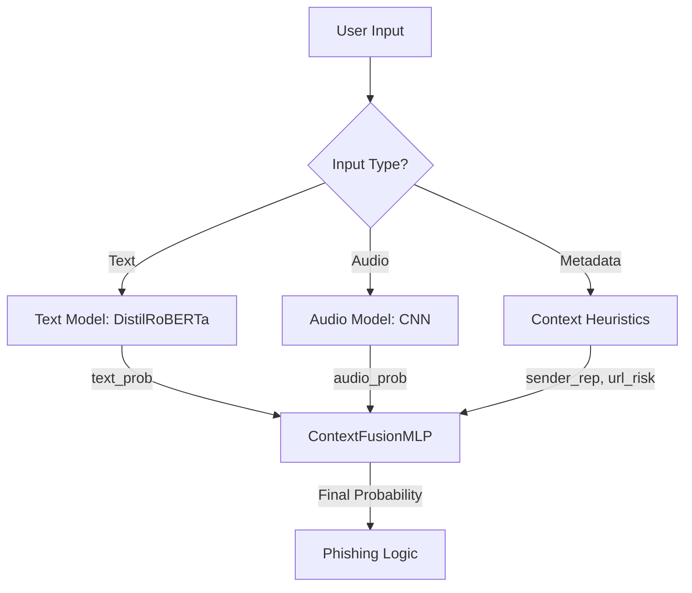

# PhishingFusion Project

PhishingFusion is a sophisticated **multimodal phishing detection system** that goes beyond simple text analysis. It fuses three distinct layers of intelligence to detect fraud with high precision:

1.  **Semantic Analysis**: Uses a fine-tuned **DistilRoBERTa** model to detect urgency, threats, and suspicious patterns in text.
2.  **Audio Analysis**: Uses a custom **CNN (Convolutional Neural Network)** to detect synthetic voice artifacts and suspicious audio patterns in calls.
3.  **Context Awareness** (✨ NEW): Analyzes **Sender Reputation** (Trust verification) and **URL Risk** to reduce false positives for Security Alerts.

---

## 🏗️ System Architecture

The core of the system is the **ContextFusionMLP**, a neural network that combines outputs from the specialized sub-models:



### Key Logic
*   **Trusted Sender Override**: If a message comes from a verified source (e.g., `VM-HDFCBK`) and has no malicious links, the system creates a "Benign" bias even if the text sounds scary (e.g., "Your account is blocked").
*   **Fusion Intelligence**: A message with "Low Text Risk" but "High Audio Risk" + "Unknown Sender" will rightly be flagged as **Phishing**.

---

## 🚀 Getting Started

### 1. Prerequisites
Install dependencies:
```bash
pip install -r requirements.txt
```

### 2. Running the API
The backend is built with **FastAPI**.
```bash
uvicorn app:app --reload
```
API Documentation will be available at: `http://localhost:8000/docs`

---

## 🛠️ Implementation & Training Process

The system has been upgraded to a 4-input pipeline. Here is the process to reproduce or retrain the model:

### Step 1: Data Generation
Since real-world metadata (Sender IDs linked to Fraud) is scarce, we generate a synthetic "Context-Enhanced" dataset based on our existing fusion data.
*   **Script**: `scripts/generate_context_dataset.py`
*   **Logic**: Injects `sender_reputation` and `url_risk` based on the label, carefully handling "False Positive" scenarios (Trusted Sender + Scary Text).
```bash
python scripts/generate_context_dataset.py
```
*Output: `data/fusion/fusion_context.csv`*

### Step 2: Training the Fusion Model
We train the **ContextFusionMLP** on the generated dataset.
*   **Script**: `scripts/train_context_fusion.py`
*   **Model Definition**: `models/context_fusion_model.py`
```bash
python scripts/train_context_fusion.py --epochs 15
```
*Output: `models/context_fusion_model.pt`*

### Step 3: Verification
Verify the model's logic capabilities (e.g., ensuring trusted senders are classified as benign).
*   **Script**: `test_trained_model.py`
```bash
python test_trained_model.py
```

---

## 📂 Project File Structure

### 1. Backend & Context Logic
*   **`app.py`**: Main FastAPI application. Handles `/predict` requests, loads models, and manages the logic flow.
*   **`context_utils.py`**: Heuristic logic for calculating Sender Reputation and URL Risk.
*   **`models/context_fusion_model.py`**: Definition of the new 4-input Neural Network (`ContextFusionMLP`).

### 2. Audio Pipeline
*   **`scripts/train_audio.py`**: Trains the CNN model on Mel Spectrograms.
*   **`scripts/prepare_audio_advanced_v2.py`**: Converts raw audio files into processed Mel Spectrograms (`.npy`).
*   **`scripts/augment_audio.py`**: Applies noise, pitch shifts, and speed changes to augment training data.
*   **`scripts/generate_phishing_audio.py`**: Uses TTS to create synthetic phishing audio samples.

### 3. Text Pipeline
*   **`scripts/train_text.py`**: Fine-tunes **DistilRoBERTa** on the phishing text dataset.
*   **`scripts/prepare_text_dataset.py`**: Cleans and tokenizes text data for training.

### 4. Fusion & Context Pipeline
*   **`scripts/generate_context_dataset.py`**: Creates the "Context-Enhanced" dataset (Synthetic Metadata + Model Probs).
*   **`scripts/train_context_fusion.py`**: Trains the final decision layer (4-input MLP).
*   **`scripts/train_fusion_prob.py`**: (Legacy) Trains the original 2-input fusion model.

### 5. Verification & Testing
*   **`test_trained_model.py`**: Verifies the inference of the trained 4-input model.
*   **`test_context_logic.py`**: Unit tests for the heuristic context functions.

---

## 📊 Performance & Models
The system uses a hierarchy of models:

1.  **Audio Model**: CNN trained on Mel Spectrograms. Detects *how* something is said.
2.  **Text Model**: DistilRoBERTa. Detects *what* is said.
3.  **Context Fusion Model**: 4-Input MLP. Detects the *overall risk* by combining the above with *who* said it.

**Context Fusion Results**:
*   **Trusted Sender Scenarios**: ~0.03% Risk Score (Benign)
*   **Phishing Scenarios**: >99.9% Risk Score (Phishing)

